# Poralikha - A Comprehensive Productivity App

## Overview
**Poralikha** is a Flutter-based productivity application that integrates multiple features, including classroom management, a calendar, reminders, to-do tasks, and notes. The app leverages Firebase for authentication and real-time data synchronization, along with local notifications for user engagement.

## Features
- **Authentication**: Firebase Authentication with email/password and Google Sign-In.
- **Classroom Management**: Displays class schedules and assignments with reminder integration.
- **Calendar**: Lists events in a scrollable view with quick navigation to today's events.
- **Reminders**: Allows setting task reminders with local notifications.
- **To-Do List**: Provides task management with CRUD operations and swipe gestures.
- **Notes**: Enables note-taking with search, sorting, and list/grid views.
- **User Profile**: Displays user information, supports dark mode, and includes a logout option.

## Tech Stack
- **Frontend**: Flutter (Dart)
- **Backend**: Firebase Firestore
- **Authentication**: Firebase Authentication, Google Sign-In
- **Local Notifications**: Flutter Local Notifications

## Screenshots
### Login and Sign Up
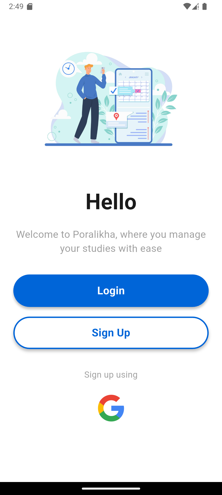 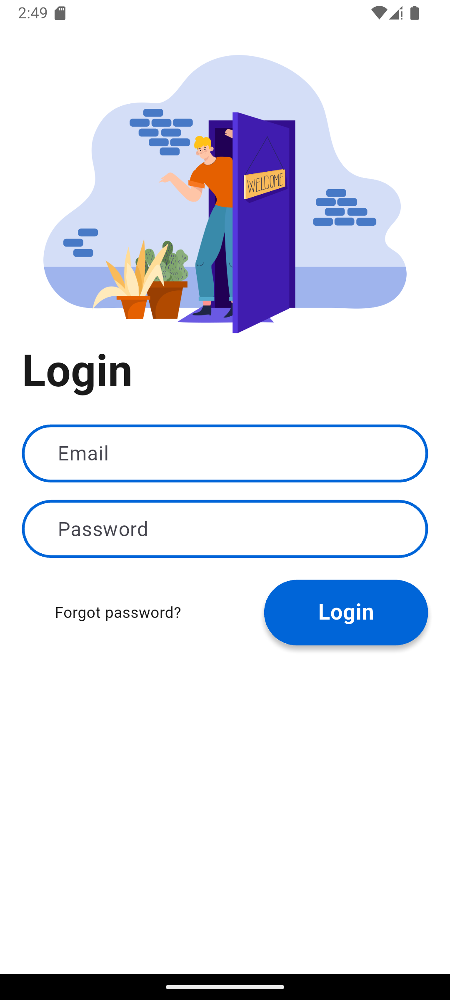 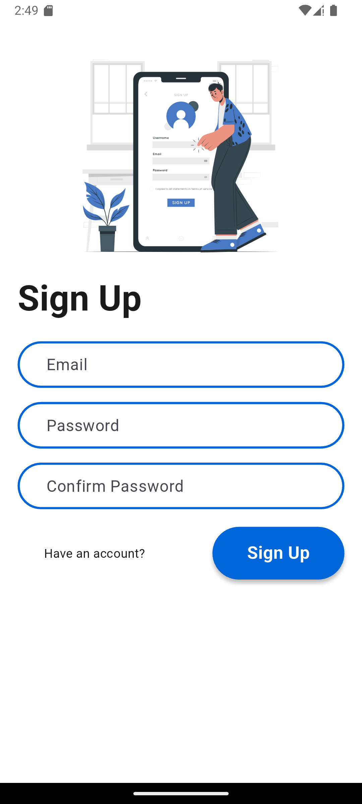

### Reminders
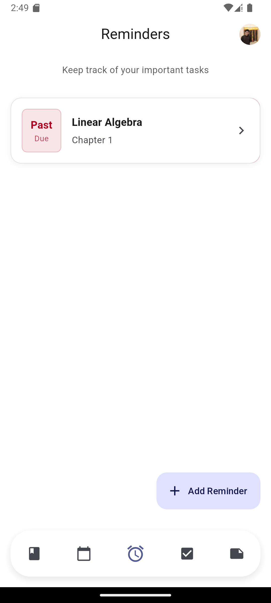 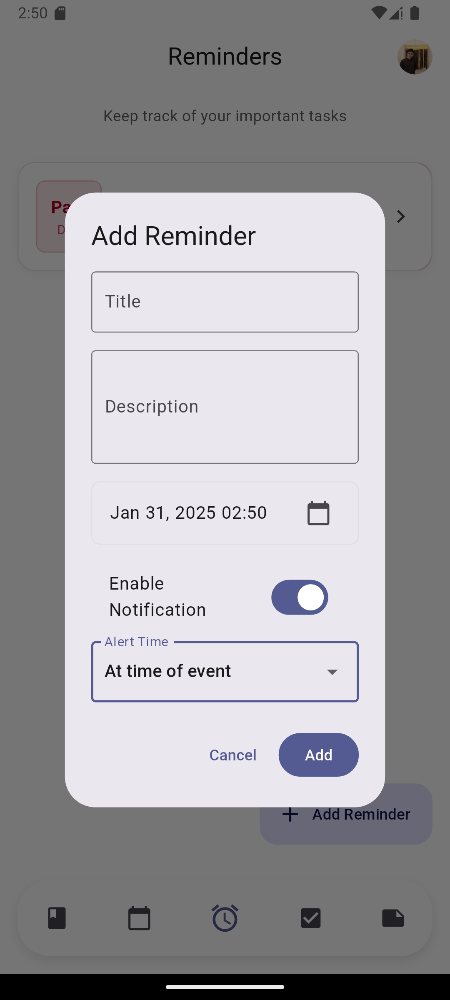 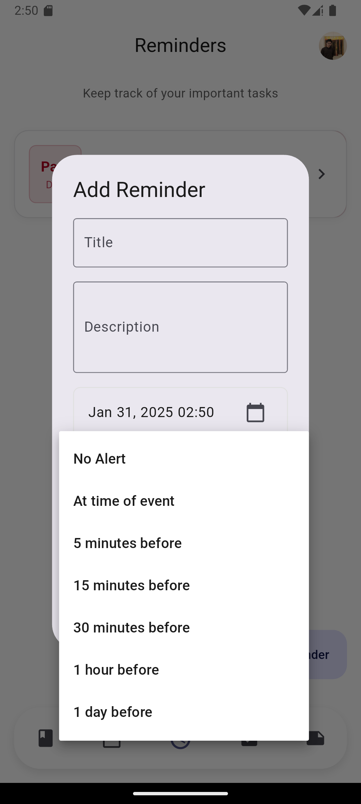

### To-Do and Notes
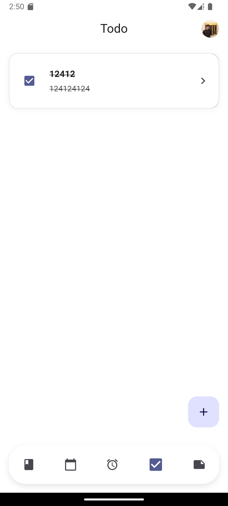 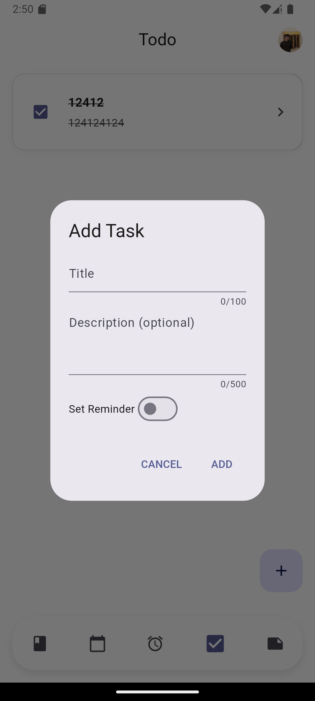 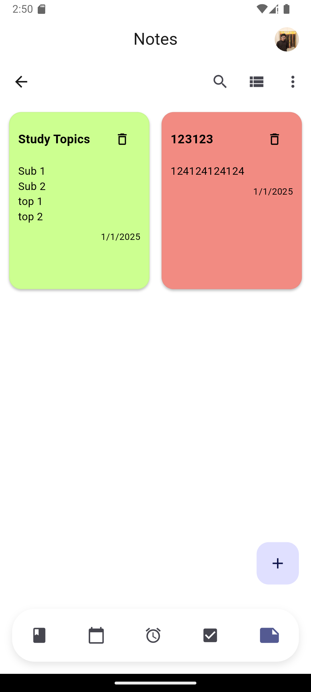

### Notes and Classroom Features
 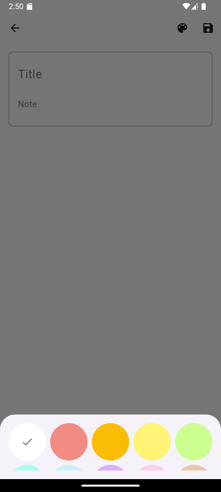 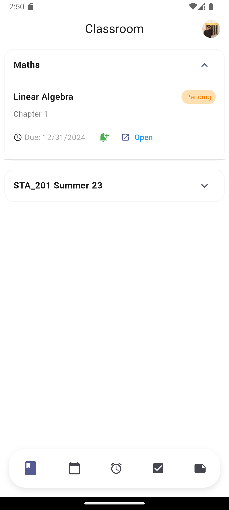

### Calendar and User Profile
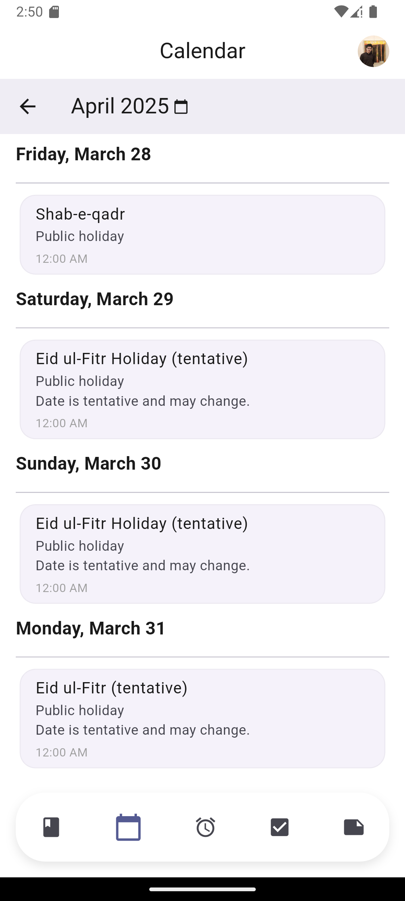 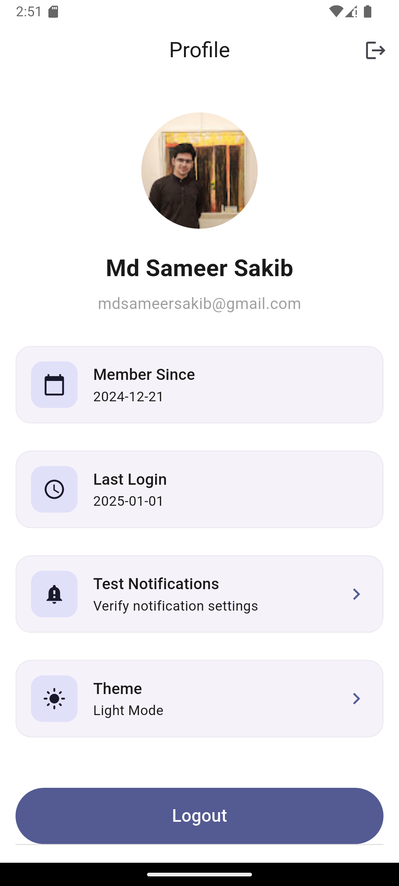 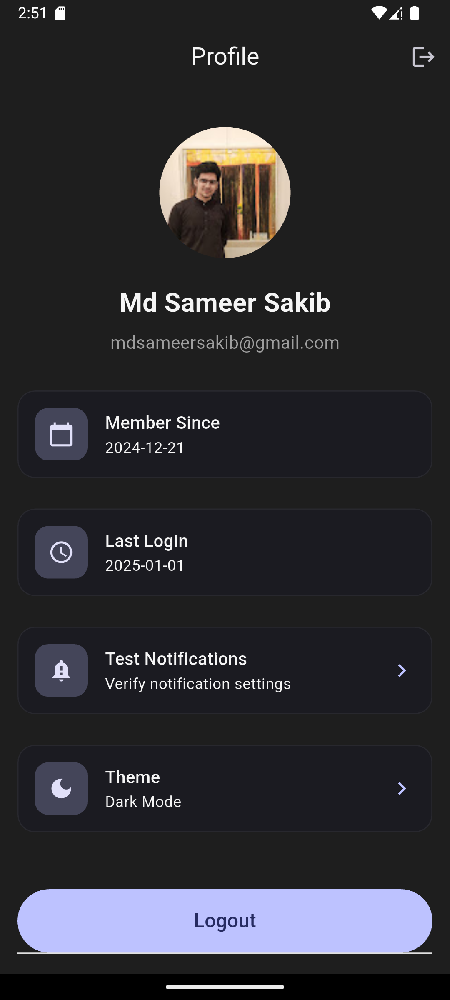

### Dark Mode
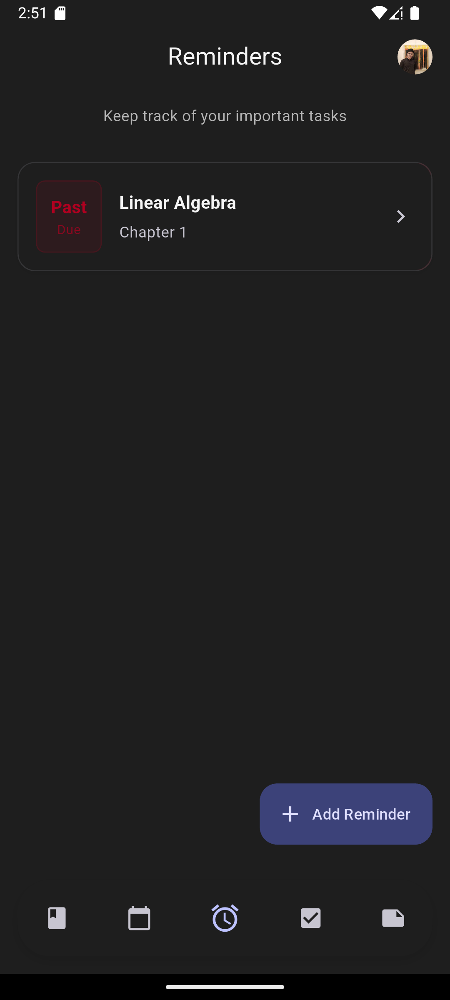 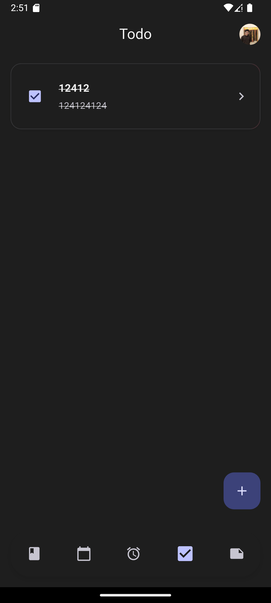 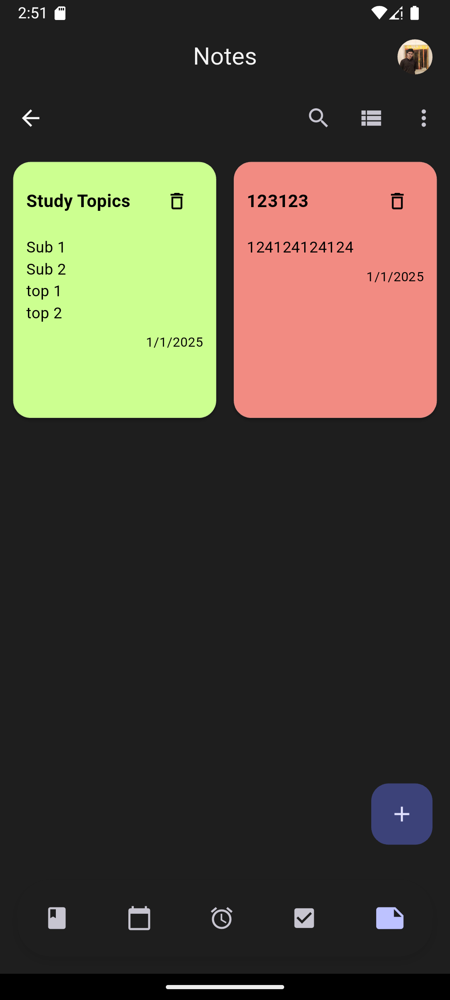

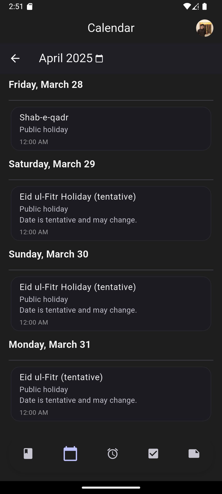 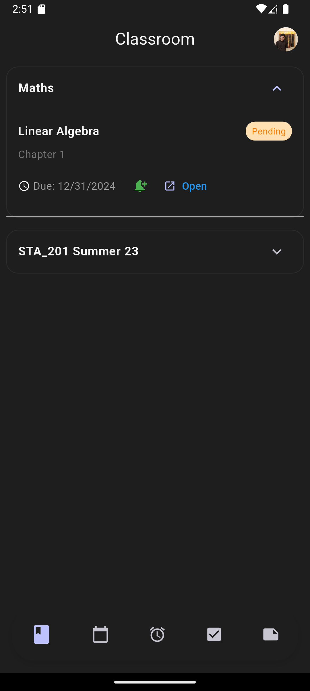

## Future Enhancements
- Improve UI design for better user experience.
- Introduce recurring events in the calendar.
- Implement collaborative features for notes and tasks.
- Add advanced analytics for classroom data.
